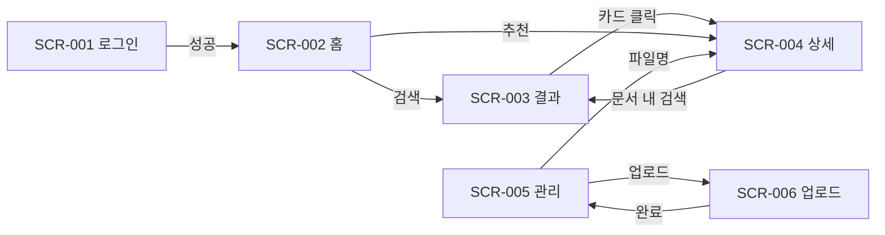

# 화면설계서 — 지식 문서 검색 서비스 (샘플)

| 항목 | 내용 |
|------|------|
| **문서 ID** | SCR-SPEC-2026-001 |
| **프로젝트명** | KnowledgeDoc Search (PoC) |
| **버전** | 0.1 (샘플) |
| **작성일** | 2026-06-04 |
| **작성자** | Product / UX |
| **상태** | Draft |

---

## 1. 개요

### 1.1 목적

사용자가 Markdown 기반 내부 문서를 업로드·색인하고, 자연어로 검색·미리보기할 수 있는 웹 서비스의 화면 범위와 UI 동작을 정의한다.

### 1.2 대상 사용자

| 역할 | 설명 |
|------|------|
| **일반 사용자** | 문서 검색, 결과 열람 |
| **운영자** | 문서 업로드, 색인 상태 확인 |

### 1.3 용어

| 용어 | 정의 |
|------|------|
| **문서** | `.md` 단일 파일 또는 ZIP 내 MD 묶음 |
| **청크** | 검색·RAG용으로 분할된 문서 단위 |
| **색인** | 업로드 후 서버에서 파싱·임베딩이 완료된 상태 |

### 1.4 화면 목록

| 화면 ID | 화면명 | URL (예시) | 우선순위 |
|---------|--------|------------|----------|
| SCR-001 | 로그인 | `/login` | P0 |
| SCR-002 | 홈 / 검색 | `/` | P0 |
| SCR-003 | 검색 결과 | `/search?q=` | P0 |
| SCR-004 | 문서 상세 | `/docs/{docId}` | P0 |
| SCR-005 | 문서 관리 (운영) | `/admin/documents` | P1 |
| SCR-006 | 업로드 | `/admin/upload` | P1 |

---

## 2. 공통 UI

### 2.1 레이아웃

```
┌─────────────────────────────────────────────────────────────┐
│ [Logo]  검색                    [문서관리▾]  [사용자▾]       │  ← GNB (로그인 후)
├─────────────────────────────────────────────────────────────┤
│                                                             │
│                      Main Content Area                      │
│                                                             │
├─────────────────────────────────────────────────────────────┤
│ © 2026 · 이용약관 · 개인정보                                │  ← Footer (선택)
└─────────────────────────────────────────────────────────────┘
```

### 2.2 공통 컴포넌트

| 컴포넌트 ID | 명칭 | 설명 |
|-------------|------|------|
| CMP-TOAST | 토스트 | 성공/실패 메시지, 3초 후 자동 닫힘 |
| CMP-EMPTY | 빈 상태 | 검색 결과 없음, 목록 없음 |
| CMP-LOAD | 로딩 | 스켈레톤 또는 스피너, 300ms 이상 지연 시 표시 |

### 2.3 반응형

| 구간 | 너비 | 비고 |
|------|------|------|
| Mobile | &lt; 768px | GNB → 햄버거, 검색창 전체 너비 |
| Desktop | ≥ 768px | 기본 레이아웃 |

---

## 3. 화면별 상세

### SCR-001 로그인

| 항목 | 내용 |
|------|------|
| **목적** | 인증 후 서비스 이용 |
| **진입** | 미인증 시 보호 URL 접근, 로그아웃 후 |
| **이탈** | 로그인 성공 → SCR-002, 취소 → (없음, 단일 목적 화면) |

#### 3.1.1 화면 구성 (와이어)

```
        ┌──────────────────────────┐
        │     KnowledgeDoc         │
        │                          │
        │  이메일 [____________]   │
        │  비밀번호 [__________] 👁  │
        │                          │
        │  [ ] 로그인 상태 유지      │
        │  [      로그인      ]     │
        │                          │
        │  비밀번호 찾기 (P2)       │
        └──────────────────────────┘
```

#### 3.1.2 UI 요소

| No | 요소 | 타입 | 필수 | 검증 / 제약 |
|----|------|------|------|-------------|
| 1 | 이메일 | Input email | Y | 형식, max 254 |
| 2 | 비밀번호 | Input password | Y | min 8 |
| 3 | 로그인 상태 유지 | Checkbox | N | localStorage 토큰 TTL 연장 |
| 4 | 로그인 | Button primary | — | 클릭 시 API `POST /auth/login` |
| 5 | 비밀번호 표시 | Icon toggle | N | password ↔ text |

#### 3.1.3 이벤트

| 트리거 | 동작 | 결과 |
|--------|------|------|
| 로그인 클릭 | 클라이언트 검증 → API 호출 | 성공: SCR-002, 실패: 인라인 에러 |
| Enter (폼 내) | 로그인과 동일 | 동일 |

#### 3.1.4 예외 / 메시지

| 코드 | 조건 | 사용자 메시지 |
|------|------|----------------|
| E-AUTH-001 | 자격 증명 불일치 | 이메일 또는 비밀번호를 확인해 주세요. |
| E-AUTH-002 | 계정 잠금 | 5회 실패로 30분 후 다시 시도해 주세요. |
| E-NET | 네트워크 오류 | 연결을 확인한 뒤 다시 시도해 주세요. |

---

### SCR-002 홈 / 검색

| 항목 | 내용 |
|------|------|
| **목적** | 자연어 검색 시작점 |
| **진입** | 로그인 후 기본 랜딩, GNB 로고 |
| **이탈** | 검색 실행 → SCR-003 |

#### 3.2.1 화면 구성

```
  ┌─────────────────────────────────────────────┐
  │  내부 문서를 한곳에서 검색하세요              │
  │  ┌─────────────────────────────────┐ [검색]│
  │  │ placeholder: 예) RAG 청킹 전략   │        │
  │  └─────────────────────────────────┘        │
  │  최근 검색: [태그] [태그] [태그]  (최대 5)    │
  │  ─────────────────────────────────────────  │
  │  추천 문서 (운영 설정 시)                    │
  │  · 제목 A    · 제목 B    · 제목 C           │
  └─────────────────────────────────────────────┘
```

#### 3.2.2 UI 요소

| No | 요소 | 설명 |
|----|------|------|
| 1 | 검색어 입력 | max 500자, trim |
| 2 | 검색 버튼 | 비활성: 공백만 / 1자 미만 |
| 3 | 최근 검색 | localStorage, 클릭 시 즉시 SCR-003 |
| 4 | 추천 문서 카드 | 선택 시 SCR-004 |

#### 3.2.3 상태

| 상태 | 표시 |
|------|------|
| 초기 | placeholder, 최근 검색(있을 때) |
| 로딩 | (검색은 SCR-003에서 처리) |

---

### SCR-003 검색 결과

| 항목 | 내용 |
|------|------|
| **목적** | 질의에 대한 문서·청크 단위 결과 목록 |
| **진입** | SCR-002 검색, SCR-004 내 “이 문서에서 검색” |
| **쿼리** | `q`, `page`, `sort` (relevance \| date) |

#### 3.3.1 화면 구성

```
  검색어: "RAG 청킹"     약 42건 · 0.3초
  [관련도▼] [최신순]

  ┌────────────────────────────────────────────┐
  │ 📄 Advanced RAG Techniques                 │
  │ …청킹 전략과 메타데이터 enrichment… (하이라이트) │
  │ 문서 · 2026-02-17 · 청크 #3                │
  └────────────────────────────────────────────┘
  ┌────────────────────────────────────────────┐
  │ 📄 …                                       │
  └────────────────────────────────────────────┘

  [ 이전 ]  1 2 3 …  [ 다음 ]
```

#### 3.3.2 UI 요소

| No | 요소 | 동작 |
|----|------|------|
| 1 | 결과 카드 | 클릭 → SCR-004 (`docId`, `chunkId` optional) |
| 2 | 하이라이트 | 서버 `snippet` HTML sanitize 후 렌더 |
| 3 | 정렬 | 변경 시 `page=1` 리셋 후 재조회 |
| 4 | 페이지네이션 | page size 10 |

#### 3.3.3 빈 상태 (CMP-EMPTY)

- 문구: `"{q}"에 대한 결과가 없습니다.`
- 보조: 맞춤법 확인, 다른 키워드 제안 (P2)

---

### SCR-004 문서 상세

| 항목 | 내용 |
|------|------|
| **목적** | 원문 MD 렌더링 및 목차·청크 메타 표시 |
| **진입** | SCR-003 카드, SCR-002 추천, 직접 URL |

#### 3.4.1 레이아웃

```
  ┌──────────┬────────────────────────────────────┐
  │ 목차     │  # 제목                            │
  │ · H2     │  본문 (Markdown → HTML)            │
  │ · H2     │                                    │
  │          │  [이 문서에서 검색]  [원본 다운로드] │
  └──────────┴────────────────────────────────────┘
```

#### 3.4.2 UI 요소

| No | 요소 | 설명 |
|----|------|------|
| 1 | 목차 | H2~H3 앵커 스크롤 |
| 2 | 본문 | 코드블록·표 보존 |
| 3 | 청크 배지 | URL `chunkId` 있으면 해당 구간 스크롤 + 강조 |
| 4 | 이 문서에서 검색 | SCR-002로 이동, `docId` 필터 고정 (P1) |

---

### SCR-005 문서 관리 (운영)

| 항목 | 내용 |
|------|------|
| **목적** | 업로드 문서 목록·색인 상태 관리 |
| **권한** | Role `admin` |
| **진입** | GNB 문서관리 |

#### 3.5.1 테이블 컬럼

| 컬럼 | 설명 |
|------|------|
| 파일명 | 클릭 → SCR-004 (색인 완료 시) |
| 업로드일 | ISO → 로컬 표시 |
| 상태 | `pending` \| `indexing` \| `ready` \| `failed` |
| 청크 수 | ready일 때만 |
| 액션 | 재색인, 삭제(확인 모달) |

#### 3.5.2 상태 배지 색 (가이드)

| 상태 | 색 | 의미 |
|------|-----|------|
| pending | gray | 대기 |
| indexing | blue | 처리 중 |
| ready | green | 검색 가능 |
| failed | red | 오류, 툴팁에 사유 |

---

### SCR-006 업로드 (운영)

| 항목 | 내용 |
|------|------|
| **목적** | MD/ZIP 업로드 및 색인 트리거 |
| **진입** | SCR-005 [+ 업로드] |

#### 3.6.1 UI

- Drag & Drop 영역 + [파일 선택]
- 허용: `.md`, `.zip` (내부 MD만), max 50MB
- 업로드 진행률 바 → 완료 시 SCR-005로 이동 + 토스트

#### 3.6.2 검증

| 조건 | 메시지 |
|------|--------|
| 확장자 불일치 | md 또는 zip 파일만 업로드할 수 있습니다. |
| 용량 초과 | 파일 크기는 50MB 이하여야 합니다. |

---

## 4. 화면 전이도



---

## 5. API 연계 (참고)

| 화면 | Method | Endpoint | 비고 |
|------|--------|----------|------|
| SCR-001 | POST | `/auth/login` | JWT |
| SCR-003 | GET | `/search?q=&page=&sort=` | |
| SCR-004 | GET | `/documents/{id}` | |
| SCR-005 | GET | `/admin/documents` | |
| SCR-006 | POST | `/admin/documents` | multipart |

---

## 6. 비기능 (화면 관점)

| 항목 | 기준 |
|------|------|
| 검색 결과 TTI | 첫 결과 페인트 &lt; 2s (P95) |
| 접근성 | 포커스 링, 검색 폼 label, 대비 WCAG AA |
| i18n | 1차 ko-KR, 문자열 키 분리 (P2 en) |

---

## 7. 변경 이력

| 버전 | 일자 | 변경 내용 | 작성자 |
|------|------|-----------|--------|
| 0.1 | 2026-06-04 | 초안 샘플 작성 | — |
